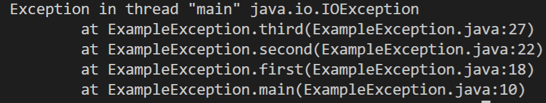

# Week 3 Discussion - Class variables and methods

## What is exception propagation?

### Give an example of a class that contains at least two methods, in which one method calls another. Ensure that the subordinate method will call a predefined Java method that can throw a checked exception. The subordinate method should not catch the exception. Explain how exception propagation will occur in your example

When an exception is thrown, it is attempted to be resolved by the runtime system. When you call methods in a certain order, they are then propagated (or attempted to be fixed) in reverse order. What makes this week's discussion a bit of a tricky question is that we are asked to propagate a checked exception. Checked exceptions are also called compile-time exceptions because if you do not handle them with a try catch (or a very specify other way he says foreshadowing...) your code will not compile or your ide will just bug you to fix it. To propagate a checked exception, you must use the throws keyword. So if you look at the code below, if you were to remove the throws keyword from the method, it would cause the red squiggly stating : "Unhandled exception type IOException" you can see the order in which the exception is propagated by looking at the stack trace which is printed in terminal. I'll paste that below the code.

    import java.io.IOException;

    public class ExampleException {
        // Even main needs a throws
        public static void main(String[] args) throws IOException {

            ExampleException e = new ExampleException();

            // first method is called without a try catch
            e.first();
        }

        public ExampleException() {
        }

        // which calls the second
        public void first() throws IOException{
            second();
        }
        // which calls the third
        public void second() throws IOException{
            third();
        }
        // which throws a new IOExceptions
        // Thats a whole lotta "throws"
        public void third() throws IOException{
            throw new IOException(); //the exception is now propagated back
        }
    }

Now in the stack trace below, you can see how it was first attempted to be resolved at third, second, first, and lastly main. It is important to note that the topmost method call will always be the one in which the exception was thrown first. Then it even hooks you up and lets you know which line.

