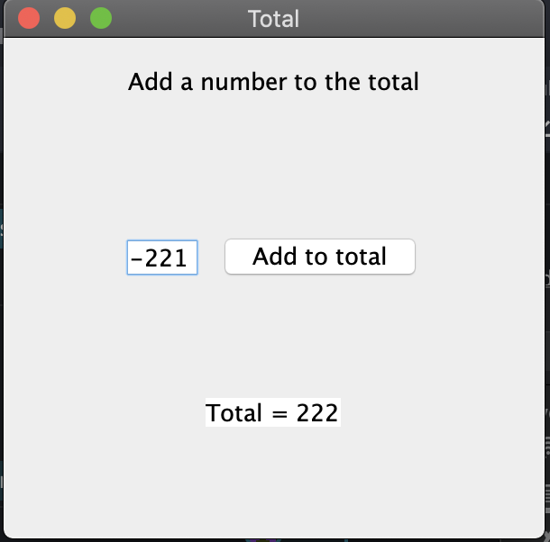
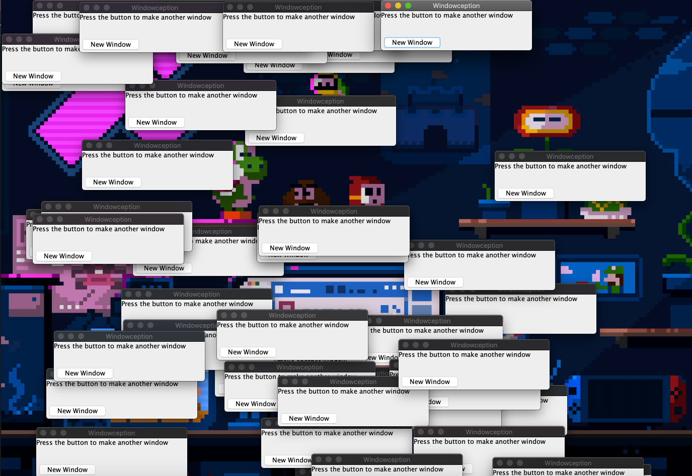

# Week 4 Discussion - GUIs and event handlers

## Give an example of a program that creates a GUI with at least one button and several textfields. Some of the textfields should be for input and others for output. Make the output textfields uneditable. When the button is clicked, the input fields should be read, some calculation performed and the result displayed in the output textfield(s)

I just made a GUI that takes an int and adds it to a running total. The program then prints the total to a text area. I did some messing around with borders and grid layout to find out a setup I didn't hate. This one has three rows, each of which I added a JPanel before adding components to those.

for fun, I made another GUI that just makes more GUIs which appear at random places lol.

